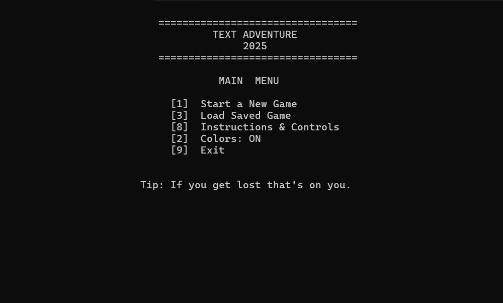

# Deterministic Text Adventure Engine (C++)

> A deterministic C++ game engine designed around strict state control,
replay validation, and polymorphic execution strategies.

<p align="center">
  
</p>


---

## Overview

This project implements a console-based deterministic game engine focused on architectural clarity and strict state control.

Its primary goal is not gameplay complexity, but deterministic correctness and reproducible execution across runtime modes.

Every recorded session produces an identical state evolution and final outcome.

---

## Deterministic Simulation Model

The engine operates in a controlled tick-based simulation loop where:

- All state transitions are deterministic  
- State mutations are explicit and validated  
- Only minimal non-derivable data is recorded  
- Replay execution reconstructs the exact state evolution  

This guarantees reproducibility and enables regression-style automated validation.

There are no hidden side effects, undefined behavior dependencies, or implicit randomness affecting state progression.

---

## Execution Modes

```
adv-world.exe
adv-world.exe -save
adv-world.exe -load [-silent]
```

### Normal Mode
Runs the interactive simulation as a standard console game.

### Save Mode
- Records deterministic session input and significant events  
- Produces:
  - `adv-world.steps`
  - `adv-world.result`

### Load Mode
- Replays recorded input without accepting new interaction  
- Reconstructs identical state transitions  

### Silent Mode
- Executes without rendering  
- Validates actual results against expected output  
- Functions as a lightweight automated validation mechanism  

---

## Architecture

The engine is structured around polymorphic execution layers:

- `Game` — core deterministic simulation engine  
- `SaveGame` — extends `Game` to record deterministic sessions  
- `LoadGame` — extends `Game` to replay and validate sessions  

Architectural principles emphasized:

- Separation of concerns  
- Inheritance and polymorphism  
- Deterministic state control  
- Modular execution strategies  
- Clear runtime boundary definitions  

The simulation logic remains a single source of truth across all execution modes.

---

## Dynamic Room Loading

Rooms are parsed from structured `.screen` files including:

- Board layout definition  
- Legend positioning constraints  
- Metadata directives (`#ROOM`, `#KEY`, `#DOOR`, `#RIDDLE`, etc.)  

The parser enforces strict format validation and produces descriptive error reporting for malformed definitions.

Malformed input cannot corrupt runtime state.

---

## Engineering Challenges Addressed

### Deterministic Replay Guarantee
To ensure identical replay behavior:

- Strict control over state mutation  
- Clear separation between input logging and derived events  
- Recording only essential non-derivable data  
- Prevention of hidden non-deterministic behavior  

### Execution Strategy Isolation
Multiple runtime behaviors (normal, save, load, silent) are supported while preserving a single simulation engine core.

This required explicit separation between:

- Simulation logic  
- Rendering  
- Input handling  
- Validation  

---

## Technical Concepts Demonstrated

- Object-Oriented Design  
- Inheritance & Polymorphism  
- Deterministic simulation modeling  
- Replay-based validation systems  
- Structured metadata parsing  
- State-driven architecture  
- Explicit error handling  
- Runtime strategy separation  

---

## Project Structure

src/      → Core engine implementation  
docs/     → File format documentation  
README.md → Project overview

---
## Build

- Requires: Windows x64, Visual Studio 2022  
- Open the solution in Visual Studio  
- Build in x64 (Debug or Release)  
- Run with optional command-line parameters  

All files are read from and written to the current working directory.

---

## Summary

This project demonstrates how deterministic simulation architecture can be applied to a state-driven engine with replay validation and execution-mode polymorphism.

It serves as a focused exercise in system design, reproducibility, and clean runtime separation in modern C++.
